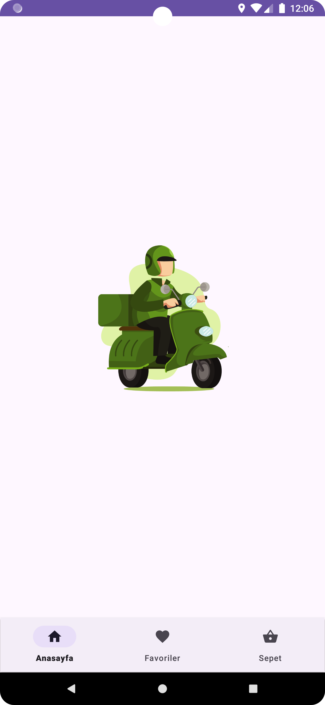
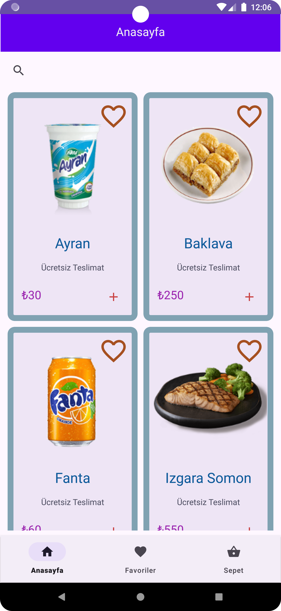
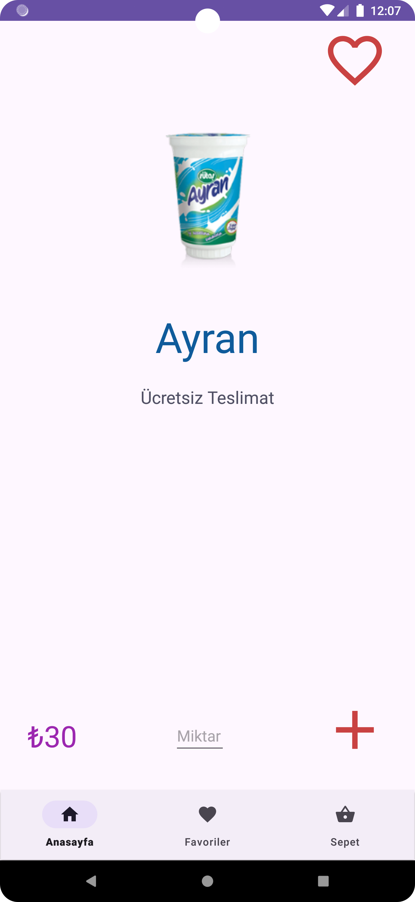
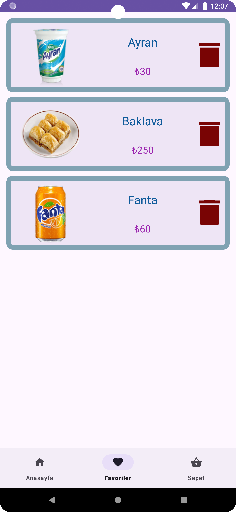
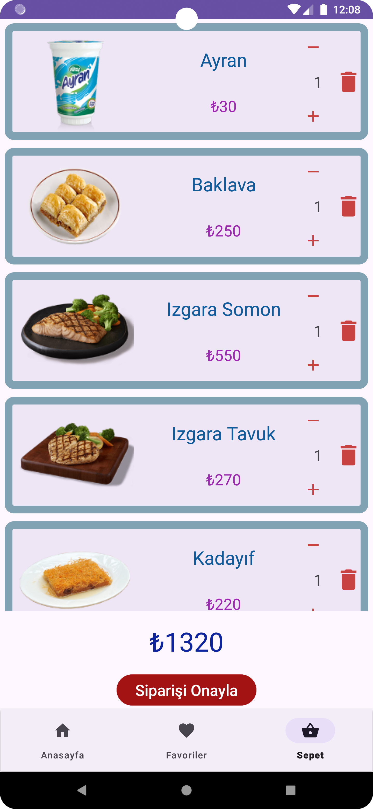

# 🍽️ Yemek Sipariş Uygulaması / Food Order App

  
  
  
  
  

## 📱 Uygulama Özellikleri (Türkçe)

- **Açılış Animasyonu**  
  Uygulama açıldığında LottieFiles ile yapılmış bir kurye animasyonu 3 saniye boyunca gösterilir.

- **Anasayfa**  
  - Tüm yemekler bir `RecyclerView` ile listelenir.  
  - Üst kısımda bir `SearchView` bulunur. Büyük/küçük harf duyarsız arama yapılabilir.  
  - Bir yemeğe tıklanınca detay sayfasına geçilir.

- **Yemek Detay Sayfası**  
  - İstediğiniz miktarda yemek sepete eklenebilir.  
  - Yemek favorilere de eklenebilir.

- **Favoriler Sayfası**  
  - Favorilere eklenen yemekler burada görüntülenebilir.

- **Sepet Sayfası**  
  - Sepete eklenen yemekler listelenir.  
  - Ürünler artırılıp azaltılabilir ya da silinebilir.  
  - Sayfanın alt kısmında toplam tutar gösterilir.  
  - “Siparişi Onayla” butonuna basıldığında bir `Snackbar` çıkar.  
  - Onay verildiğinde kurye animasyonu tekrar gösterilir, sepet boşaltılır ve anasayfaya dönülür.
- **🌐 API Entegrasyonu (Retrofit)**  
  Tüm yemek verileri bir REST API'den `Retrofit` kütüphanesi ile çekilmektedir.

---

## 📱 App Features (English)

- **Splash Animation**  
  On app launch, a delivery animation (made with LottieFiles) is displayed for 3 seconds.

- **Home Screen**  
  - All meals are listed using a `RecyclerView`.  
  - A `SearchView` at the top allows case-insensitive meal searching.  
  - Tapping on a meal opens its detail page.

- **Meal Detail Page**  
  - You can add any quantity of a meal to the cart.  
  - You can also mark meals as favorites.

- **Favorites Page**  
  - View all meals you’ve marked as favorites.

- **Cart Page**  
  - Lists all meals added to the cart.  
  - Meals can be increased, decreased, or removed.  
  - The total amount is shown at the bottom.  
  - A “Confirm Order” button shows a `Snackbar`.  
  - If confirmed, the delivery animation plays again, the cart is emptied, and you return to the home screen.

- **🌐 API Integration (Retrofit)**  
  All meal data is fetched from a REST API using the `Retrofit` library.
---

🎨 **Used Technologies**:  
- Kotlin  
- Android Studio  
- MVVM Architecture  
- LottieFiles Animations  
- ViewBinding  
- RecyclerView, SearchView, Snackbar

